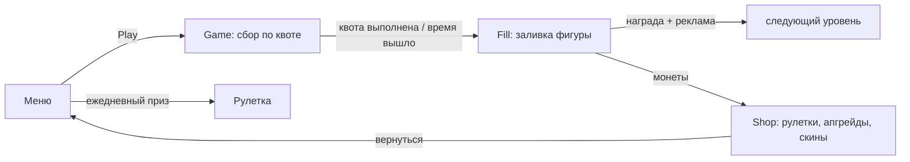

# ГДД — Mad Slime

> Главный дизайн-документ. Состояние на 2026-09-28, ветка `MadSlimeV2` — все числа сверены с конфигами и кодом. Детали реализации — в [[Архитектура]] и [[Граф модулей]]; список проблем — [[Техдолг и баги]].

## 1. Паспорт

| | |
|---|---|
| **Название** | Mad Slime |
| **Жанр** | казуальная аркада «пожиратель» + мета-петля (магазин, рулетки, скины) |
| **Платформа** | WebGL, Яндекс.Игры (YG2 SDK) |
| **Движок** | Unity 2022.3.62f2 LTS, 3D low-poly, uGUI (портрет 1080×1920) |
| **Сессия** | раунд ~1.5–2 мин (90 с на сбор + заливка) + мета между раундами |
| **Ориентир монетизации** | interstitial между раундами + 3 rewarded-входа |
| **Сцены** | `Menu`(0) → `Game`(1) → `Fill`(2), `Shop`(3) боком; `Test.unity` — только на диске |
| **Языки** | ru / en / tr (ru — источник, фолбэки tr→en→ru) |

## 2. Ядро игры (одна фраза)

Слизень ест предметы и растёт: сначала поедает только мелочь, с ростом открывает более крупные тиры, выполняет квоту «съешь N штук таких-то» до конца таймера — и заливает фигуру кубиками ради монет, которые тратит на апгрейды, перки и скины в магазине.

## 3. Основной цикл

Полный круг: **сбор → заливка → деньги → усиление → сбор сложнее**. Уровни берутся из каталога диапазонов; прогресс уровня, максимальный уровень, монеты и всё мета-состояние живут в сейве YG2.

## 4. Сессия Game — «ешь предметы»

### Управление
WASD / геймпад-стик / виртуальный джойстик (появляется в точке касания). Раунд стартует **замороженным** — первый ввод движения запускает таймер и аналитику.

### Рост по тирам
- Тиры предметов: `Small → Medium → Large → Boss` ([[TierTable]] задаёт масштаб и массу каждого)
- Масса предметов копится в массу игрока ([[PlayerTier]]); пороги масс из [[PlayerConfig]] открывают следующий тир: модель и коллайдер плавно растут (овершут-анимация), камера отъезжает, скорость обновляется
- Есть только то, что **не выше твоего тира**; предметы на тир выше при перке Ambitions. Слишком крупные вплотную становятся **призраками** (dither-полупрозрачность) — не мешают обзору
- Радиусы «рта» и магнита масштабируются с тиром игрока

### Магнит и поедание
Предметы в радиусе магнита сами текут к слайму по спирали (разгон у «рта», орбитальный свёрл), у рта — дуга полёта в пасть (Безье, вращение, сжатие), при поедании — squash и звук с растущим питчем. Камера «дышит»: подтяжка от массы съеденного, шейк от тяжёлых предметов, толчок и FOV-кик на тир-апе.

### Квота
- Случайная генерация из того, что реально заспавнено: 1–3 типа × 3–8 штук, максимум 2 типа на один тир (квота всегда выполнима и не вся из мелочи)
- Квотные предметы дают повышенную массу и «заливку» (см. Fill); посторонние — обычную массу и малую заливку
- Выполнил квоту → сразу в Fill. Таймер (90 с) вышел → тоже в Fill, но с тем, что успел

### Перки в геймплее
| Перк | Эффект |
|---|---|
| Smell («Нюх») | квотные предметы подсвечены жёлтым |
| Adrenaline | +40% скорости на последних 25% таймера |
| Ambitions («Амбиции») | можно есть на 1 тир выше своего |

## 5. Сессия Fill — «залей фигуру»

Форма уровня — из текстуры темы (альфа = силуэт): растр → сетка → **бордюр выстраивается каскадом**, затем фигура заливается кубами:
- **квотные кубы** — цветами пикселей текстуры (сколько = доля квоты из Game)
- **бонусные кубы** — с тинтом (за «посторонние» предметы, усиленные Метаболизмом)
- **тап №1** — ускорение ленты; **тап №2** — мгновенный залп остатка (0.25 с)
- Недолил → FailMenu: утешительные монеты (если залил ≥ 25%) + **спасение за рекламу** (долить остаток)
- Залил 100% → конфетти цветами фигуры, пунш формы, FOV-кик → WinMenu: **награда 50 монет** + кнопка **×2 за рекламу**
- Любой уход из Fill — interstitial

## 6. Экономика

Валюта одна — **монеты**. Стартовый баланс нового игрока: 250.

### Источники
| Источник | Сколько |
|---|---|
| Победа в Fill | **50** (плоско, не зависит от уровня и процента) |
| Утешение при провале (заливка ≥ 25%) | 50 / 4 = **12**; ниже — 0 |
| Ежедневная рулетка, секторы монет | ×50, ×150, ×300, ×600, ×1500 (веса 20/12/8/4/1.5) |
| Дубль эксклюзивного скина в рулетке | компенсация 100 |
| Скин-рулетка при всех собранных скинах | компенсация 100 (сектор-заглушка) |
| Rewarded ×2 | +50 к победе |

### Стоки
| Сток | Цена |
|---|---|
| Апгрейды (4 шт × 5 ступеней) | base 200–400 + step 150–300 × уровень |
| Перки (3 шт, навсегда) | 3000 / 4000 / 5000 |
| Ежедневная рулетка (платная крутка) | 100 |
| Скин-рулетка (магазин) | 300 + 150 × счётчик круток (**только растёт**) |

### Балансовая проблема (см. [[Техдолг и баги]])
Доход плоский (50 за победу), а стоки растут: скин-рулетка дорожает монотонно, перки стоят 3–5к. На эндгейме цикл «рутина → копить» неизбежен; либо растить доход (награда от уровня, множители), либо добавить сброс цены.

## 7. Мета-петля

### Апгрейды (ступенчатые, 5 ступеней)
| Тип | Эффект за ступень |
|---|---|
| Speed | +10% скорость |
| Appetite | +масса за любой предмет |
| Taste | +масса за **квотный** предмет (умножается с Appetite) |
| Metabolism | +«заливка» за посторонние предметы → больше бонусных кубов |

### Перки (одноразовые, навсегда)
Smell 3000 · Adrenaline 4000 · Ambitions 5000 — эффекты в таблице выше.

### Скины
5 скинов: Slime (старт), Pacman, TripleT, Crown (эксклюзив), Phantom (эксклюзив). Редкости: Common ×2, Rare, Epic, Legendary с весами выпадения 100/45/15/4 и цветами плашек.
- **Покупка скина** — только через скин-рулетку магазина за монеты (растущая цена); Crown и Phantom не покупаются вообще — только выигрыш в ежедневной рулетке
- Ролл двухстадийный: тир редкости по весам → равномерный скин тира; из пула исключаются уже открытые
- Экипировка: вкладка «Все скины» → превью с поворотом → выбор пишется в сейв, применяется при входе в Game

### Рулетки
- **Ежедневный приз** (из меню): фри-спин раз в 15 мин; до 3 спинов за рекламу в скользящем окне 30 мин; платные крутки за 100 всегда. Секторы: монеты + эксклюзивные скины
- **Скин-рулетка** (магазин): только за монеты; цена растёт с каждой круткой без сброса; лента-слот: idle-щёлки, спин = откат → разгон → торможение по предвыбранному индексу (3–5 оборотов, ~3.2 с)

## 8. Прогрессия уровней

- `LevelsCatalog`: диапазоны «уровни X–Y → свой LevelConfig» (тема, набор предметов, тир-диапазон, таймер 90 с, параметры квоты). Новый контент = правка ассетов, код не трогается
- Внутри уровня раскладка случайна: раскладка из библиотеки (4 формы зон: решётка, кольца, круг, рассыпание), случайное зеркалирование, случайное назначение тиров префабам (каждый тир представлен)
- `CurrentLevel`/`MaxLevel` в сейве; MaxLevel = счёт в лидерборд `max_level`

## 9. Монетизация

| Слот | Где | Триггер |
|---|---|---|
| Interstitial | выход из Fill (все исходы) | каждый переход, капа на стороне проекта нет — держится на плагине |
| Rewarded ×2 | WinMenu | удвоение награды |
| Rewarded «спасение» | FailMenu | долить заливку после провала |
| Rewarded «спин» | ежедневная рулетка | до 3 круток в окне 30 мин |

Пауза на рекламе — внутри плагина; игра уважает `IsPauseGame` при восстановлении времени. Аналитика: GameplayStart/Stop на каждую сессию. Запись очков — только авторизованным (диалог авторизации — в окне лидерборда).

## 10. Сохранения и платформа

Весь прогресс — сейв YG2 (`SavesYG`, JsonUtility): уровень, баланс, скины, апгрейды, перки, рулеточные таймеры, громкости, язык. Сохранение — по событиям (покупка, победа, выход), не по таймеру. Дефолты нового игрока: уровень 1, 250 монет, Slime открыт.

## 11. Звук и представление

Музыка сцена-специфичная (без кроссфейда), SFX — пул голосов (2 UI + 5 геймплея). Громкости — в настройках (окно Settings = PauseMenu без кнопки выхода). Ключевые ощущения — звуковые: питч пикапа, тик таймера на последних 20 с, питч кубов растёт с заполнением, фанфара приза.

## 12. Карта экранов

| Экран | Содержимое |
|---|---|
| **Menu** | Play, Ежедневный приз (экран рулетки), Магазин, Лидерборд (топ-10 + авторизация), Настройки (звук), смена языка |
| **Game** | HUD скрыт до первого ввода: таймер, тарелки квоты, полоса роста с тиром, номер уровня; пауза (продолжить / звук / в меню) |
| **Fill** | % заливки с пуншем на вехах, тап по экрану ускоряет; Win/Fail окна |
| **Shop** | 3 вкладки: Рулетка (стартовая), Улучшения (4 апгрейда + перки), Все скины (грид + превью) |

## 13. Ссылки

- Реализация: [[Архитектура]] · [[Граф модулей]] (индекс карточек модулей)
- Известные проблемы: [[Техдолг и баги]]
