# Граф модулей

> Как пользоваться:
> 1. **Mermaid-схема ниже** — обзорная карта слоёв и главных связей.
> 2. **Родной граф Obsidian** (правая панель → Graph view, Ctrl+G) — реальные связи: каждый узел = заметка модуля, **клик по узлу открывает карточку** с описанием, назначением и слабыми местами.
> 3. Ниже — кликабельный индекс всех карточек и таблица ключевых связей «кто → кому → что».

```mermaid
flowchart TB
    subgraph DI["DI и запуск"]
        ST["Startup"]
        GD["GameDirector"]
        PLS["ProjectLifetimeScope"]
        SLS["Скоупы сцен"]
        SSL["SessionStateLogger"]
    end

    subgraph CORE["Core — данные и шов"]
        LCFG["Конфиги уровней"]
        ITEM["Item и IAttractable"]
        QE["QuotaEntry"]
        IF["Интерфейсы Core (шов YG2)"]
        PCFG["PlayerConfig"]
        TT["TierTable"]
        RCFG["Конфиги скинов и рулетки"]
        UCFG["UpgradesConfig"]
        RW["RewardConfig"]
        FCFG["FillConfig"]
        MCFG["Мелкие конфиги Core"]
    end

    subgraph GAME["Сессия Game"]
        GSH["GameplaySessionHandler"]
        LCR["LevelConfigResolver"]
        LG["LevelGenerator"]
        QG["QuotaGenerator"]
        LP["LevelProgress"]
        POOL["ItemPool"]
        DET["Детекция и сбор"]
        PL["Player"]
        MV["Mover"]
        PT["PlayerTier"]
        LS["LevelScaler"]
        INP["PlayerInputReader"]
        ADB["AdrenalineBoost"]
        FX["Эффекты игрока"]
        CAM["Камера"]
        TMR["Timer"]
        SKA["SkinApplier"]
    end

    subgraph FILLG["Сессия Fill"]
        FSH["FillSessionHandler"]
        SFO["ShapeFillOrchestrator"]
        FILL["Заливка фигуры"]
        RWD["Rewarder"]
    end

    subgraph META["UI и мета-сервисы"]
        MM["MainMenu"]
        HUDN["HUD"]
        WIN["Окна"]
        UIF["UI-фабрики"]
        SHOP["ShopPanel"]
        RSV["RouletteService"]
        RVW["RouletteView"]
        RRL["RouletteReel"]
        WAL["Wallet"]
        PPR["PlayerProgress"]
        PUP["PlayerUpgrades"]
        ADS["AdScheduler"]
        LBR["LeaderboardReporter"]
        LOC["LocalizationService"]
        LOCUI["Локализация UI"]
        AUD["Аудио-подсистема"]
        PZ["Pauser"]
        UIA["UiAnimations"]
    end

    subgraph INFRA["Платформа"]
        SAV["SavesYG"]
        ADP["YG2-адаптеры"]
        CST["MadSlimeContentSetup"]
    end

    ST --> GD
    ST --> PLS
    GD --> IF
    PZ --> IF
    SSL --> PPR
    SSL --> LP
    CST --> SLS
    CST --> LCFG
    CST --> RCFG

    MM --> GD
    MM --> RVW
    MM --> WIN
    MM --> AUD

    GSH --> GD
    GSH --> TMR
    GSH --> LCR
    GSH --> LP
    GSH --> PZ
    INP --> GSH
    INP --> PL

    LCR --> LCFG
    LG --> LCR
    LG --> POOL
    LG --> QG
    LG --> LP
    LG --> TT
    LG --> MV
    QG --> QE
    DET --> PL
    DET --> POOL
    DET --> AUD
    DET --> ITEM
    PL --> LP
    PL --> PT
    PL --> TT
    PL --> PCFG
    PL --> FX
    PL --> MV
    PT --> LS
    PT --> CAM
    PT --> PCFG
    TMR --> ADB
    TMR --> HUDN
    LS --> MV
    FX --> MV
    ADB --> MV
    CAM --> PCFG
    SKA --> PPR
    SKA --> RCFG

    UIF --> WIN
    UIF --> GSH
    UIF --> FSH
    UIF --> WAL
    UIF --> ADS
    HUDN --> LP
    HUDN --> PT
    WIN --> PZ
    UIA --> INP

    FSH --> GD
    FSH --> SFO
    FSH --> RWD
    FSH --> ADS
    FSH --> LBR
    FSH --> LCR
    SFO --> FILL
    SFO --> LP
    FILL --> FCFG
    RWD --> RW
    RWD --> WAL

    SHOP --> RSV
    SHOP --> RVW
    SHOP --> WAL
    SHOP --> PUP
    SHOP --> PPR
    RVW --> RSV
    RVW --> RRL
    RVW --> ADS
    RVW --> AUD
    RSV --> RCFG
    RSV --> PPR
    RSV --> WAL
    RRL --> RCFG
    WAL --> PPR
    PUP --> PPR
    PUP --> UCFG
    LOC --> PPR
    LOC --> IF
    LOC --> LOCUI

    PPR --> IF
    ADS --> IF
    LBR --> IF
    GD -.->|"IsPauseGame"| IF
    IF --> ADP
    ADP --> SAV
```

## Таблица ключевых связей

| Откуда | Кому | Что передаёт / зачем |
|---|---|---|
| [[Startup]] | [[GameDirector]] | инжект + `EnsureInitialized` + нормализация timeScale |
| [[MainMenu]] | [[GameDirector]] | `LoadAsync(Game/Shop)`, guard `IsTransitioning` |
| [[MainMenu]] | [[RouletteView]] | `Open()` экрана ежедневного приза |
| [[PlayerInputReader]] | [[GameplaySessionHandler]] | `MovementKeyPressed` — старт раунда |
| [[GameplaySessionHandler]] | [[Timer]] | `Setup/StartCount/Stop`; слушает `Finished` |
| [[GameplaySessionHandler]] | [[LevelProgress]] | `QuotaCompleted` — конец раунда |
| [[LevelGenerator]] | [[LevelConfigResolver]] | конфиг текущего уровня |
| [[LevelGenerator]] | [[ItemPool]] | Get при спавне / Release при сборе |
| [[LevelGenerator]] | [[QuotaGenerator]] | счётчики спавна → список [[QuotaEntry]] |
| [[LevelGenerator]] | [[Mover]] | `SetBounds` — границы пола |
| [[Детекция и сбор]] | [[Player]] | `Collector.ItemCollected` — каждый укус |
| [[Player]] | [[LevelProgress]] | `RegisterCollected(definition, fillWeight)` |
| [[Player]] | [[PlayerTier]] | `Add(mass)` → `MassChanged/TierChanged` |
| [[PlayerTier]] | [[LevelScaler]] / [[Камера]] / [[HUD]] | смена тира → рост, отъезд камеры, бар |
| [[Timer]] | [[AdrenalineBoost]] / [[HUD]] | `Ticked`/`Finished` |
| [[LevelProgress]] | [[ShapeFillOrchestrator]] | FillPercent/квотный% — мост Game→Fill |
| [[FillSessionHandler]] | [[ShapeFillOrchestrator]] | `StartFill/Rescue`; слушает `FillCompleted` |
| [[FillSessionHandler]] | [[Rewarder]] | RewardWin/RewardLose |
| [[Rewarder]] | [[Wallet]] | `Add` (Save) + `RewardGranted` → окна |
| [[UI-фабрики]] | [[Окна]] | Instantiate с DI; Win/Fail/Pause |
| [[Окна]] | [[Pauser]] | pause на открытие, resume на закрытие |
| [[FillSessionHandler]] | [[AdScheduler]] | интерстишл перед выходом |
| [[UI-фабрики]] | [[AdScheduler]] | rewarded ×2 и спасение заливки |
| [[RouletteView]] | [[RouletteService]] | цены/роллы/таймеры/выдача |
| [[RouletteView]] | [[RouletteReel]] | `Build/Spin(target)`; колбэк результата |
| [[ShopPanel]] | [[PlayerUpgrades]] | покупки апгрейдов/перков |
| [[Wallet]] / [[PlayerUpgrades]] / [[RouletteService]] / [[LocalizationService]] | [[PlayerProgress]] | запись прогресса + явный `Save()` |
| [[PlayerProgress]] | [[Интерфейсы Core (шов YG2)]] | фасад над `ISavesAccess` |
| [[AdScheduler]] / [[LeaderboardReporter]] / [[Pauser]] / [[GameDirector]] | [[Интерфейсы Core (шов YG2)]] | реклама / лидерборд / `IsPauseGame` |
| [[SkinApplier]] | [[PlayerProgress]] + [[Конфиги скинов и рулетки]] | применить выбранный скин |
| [[MadSlimeContentSetup]] | [[Скоупы сцен]] / конфиги | генерация и связывание контента |

## Индекс карточек модулей

**Запуск и DI:** [[Startup]] · [[GameDirector]] · [[ProjectLifetimeScope]] · [[Скоупы сцен]] · [[SessionStateLogger]]

**Core:** [[Интерфейсы Core (шов YG2)]] · [[Конфиги уровней]] · [[Item и IAttractable]] · [[QuotaEntry]] · [[PlayerConfig]] · [[TierTable]] · [[Конфиги скинов и рулетки]] · [[UpgradesConfig]] · [[RewardConfig]] · [[FillConfig]] · [[Мелкие конфиги Core]]

**Сессия Game:** [[GameplaySessionHandler]] · [[LevelConfigResolver]] · [[LevelGenerator]] · [[QuotaGenerator]] · [[LevelProgress]] · [[ItemPool]] · [[Детекция и сбор]] · [[Player]] · [[Mover]] · [[PlayerTier]] · [[LevelScaler]] · [[PlayerInputReader]] · [[AdrenalineBoost]] · [[Эффекты игрока]] · [[Камера]] · [[Timer]] · [[SkinApplier]]

**Сессия Fill:** [[FillSessionHandler]] · [[ShapeFillOrchestrator]] · [[Заливка фигуры]] · [[Rewarder]]

**UI и мета:** [[MainMenu]] · [[HUD]] · [[Окна]] · [[UI-фабрики]] · [[ShopPanel]] · [[RouletteService]] · [[RouletteReel]] · [[RouletteView]] · [[Локализация UI]] · [[UiAnimations]] · [[Мелкие UI-компоненты]] · [[Wallet]] · [[Rewarder]] · [[PlayerProgress]] · [[PlayerUpgrades]] · [[AdScheduler]] · [[LeaderboardReporter]] · [[LocalizationService]] · [[Аудио-подсистема]] · [[Pauser]]

**Платформа:** [[SavesYG]] · [[YG2-адаптеры]] · [[MadSlimeContentSetup]]

**Сводные документы:** [[ГДД Mad Slime]] · [[Архитектура]] · [[Техдолг и баги]]
